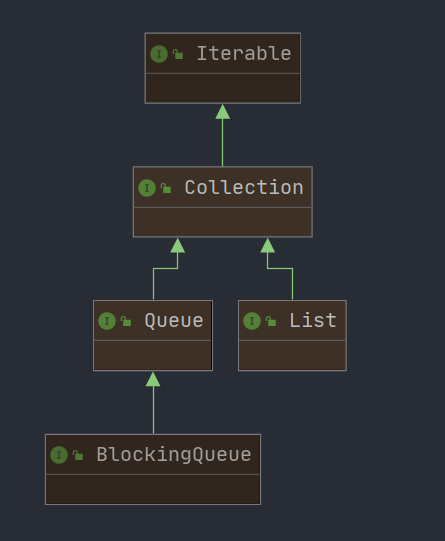

## BlockingQueue 接口

实现类：

1. ==ArrayBlockingQueue：有数组机构组成的有界阻塞队列==
2. ==LinkedBlockingQueue：有链表结构组成的有界（大小默认值是Integer.MAX_VALUE）阻塞队列==
3. PriorityBlockingQueue：支持优先级排序的无界阻塞队列
4. DelayQueue：使用优先级队列实现的延迟无界阻塞队列
5. ==SynchronousQueue：不存储元素的阻塞队列，也即单个元素的的队列==
6. LinkedTransferQueue：有链表结构组成的无界阻塞队列
7. LinkedBlocking**Deque**：有链表结构组成的双向阻塞队列


### ArrayBlockingQueue 的API：

| 方法类型 | 抛出异常  | 特殊值   | 阻塞   | 超时                 |
| -------- | --------- | -------- | ------ | -------------------- |
| 插入队尾 | add(e)    | offer(e) | put(e) | offer(e, time, unit) |
| 移除对头 | remove()  | poll()   | take() | poll(time, unit)     |
| 检查队头 | element() | peek()   | /      | /                    |


使用说明：

| 类型     | 说明                                                         |
| :------- | ------------------------------------------------------------ |
| 抛出异常 | 当阻塞队列满时，再往队列里add插入元素会抛 IllegalStateException: Queue full<br />当阻塞队列空时，再往队列里remove移除元素或取队头元素会抛 NoSuchElementException |
| 特殊值   | 插入方法，成功ture 失败false<br/>移除方法或取队头元素方法，成功返回出队列的元素，队列里面没有就返回 null |
| 一直阻塞 | 当阻塞队列满时，生产者线程继续往队列里put元素，队列会一直阻塞生产线程直到put数据or响应中断退出。<br />当阻塞队列空时，消费者线程试图从队列里take元素，队列会一直阻塞消费者线程直到队列可用。 |
| 超时退出 | 当阻塞队列满时，队列会阻塞生产者线程一定时间，超过后限时后生产者线程会退出 |


### 同步队列 SynchronousQueue

放一个就不能放第二个了，==队列中最多只能有一个元素==

```java
//Creates a SynchronousQueue with nonfair access policy.
BlockingQueue<String> syncQueue = new SynchronousQueue<>();

new Thread(()->{

    try {
        System.out.println(Thread.currentThread().getName() + " put 1");
        syncQueue.put("1");

        System.out.println(Thread.currentThread().getName() + " put 2");
        syncQueue.put("2");//阻塞，直到 B 取出 1

        System.out.println(Thread.currentThread().getName() + " put 3");
        syncQueue.put("3");

    } catch (InterruptedException e) {
        e.printStackTrace();
    }

}, "A").start();

new Thread(()->{

    try {
        try { TimeUnit.SECONDS.sleep(2); } catch (Exception ignored) { }
        System.out.println(Thread.currentThread().getName() + " take " + syncQueue.take());

        try { TimeUnit.SECONDS.sleep(2); } catch (Exception ignored) { }
        System.out.println(Thread.currentThread().getName() + " take " + syncQueue.take());

        try { TimeUnit.SECONDS.sleep(2); } catch (Exception ignored) { }
        System.out.println(Thread.currentThread().getName() + " take " + syncQueue.take());

    } catch (InterruptedException e) {
        e.printStackTrace();
    }

}, "B").start();
```


### 用在哪里

1. 生产者消费者模式⭐
2. 线程池
3. 消息中间件


三个版本：

1. sync   wait     notify
2. lock/condtion    await          signal
3. blockingqueue          take         put


> 题目：一个初始值为零的变量，两个线程对其交替操作，一个加1一个减1，来 5 轮

```java
public class Q1 {
    public static void main(String[] args) {

        Data1 data = new Data1();

        new Thread(() -> {
            for (int i = 0; i < 5; i++) {
                try {
                    data.increament();
                } catch (InterruptedException e) {
                    e.printStackTrace();
                }
            }
        }, "A").start();

        new Thread(() -> {
            for (int i = 0; i < 5; i++) {
                try {
                    data.decreament();
                } catch (InterruptedException e) {
                    e.printStackTrace();
                }
            }
        }, "B").start();

    }
}

class Data1 {
    private int num = 0;
    private ReentrantLock lock = new ReentrantLock();
    private Condition cond = lock.newCondition();

    public void increament() throws InterruptedException {

        lock.lock();//加锁，同步代码块，同sync
        try {

            while (num != 0)//判断，多线程条件下注意虚假唤醒
                cond.await();

            num++;//业务
            System.out.println(Thread.currentThread().getName() + " num = " + num);

            cond.signalAll();//通知唤醒

        } catch (Exception e) {
            e.printStackTrace();
        } finally {
            lock.unlock();
        }
    }

    public void decreament() throws InterruptedException {

        lock.lock();
        try {

            while (num == 0)
                cond.await();

            num--;
            System.out.println(Thread.currentThread().getName() + " num = " + num);

            cond.signalAll();

        } catch (Exception e) {
            e.printStackTrace();
        } finally {
            lock.unlock();
        }
    }


}
```


> **阳哥对联口诀**
>
> 上联：高内聚低耦合多线程操作资源
>
> 下联：判断干活唤醒通知
>
> 横批：防止虚假唤醒


**synchronized 和 Lock 的区别？lock有什么好处，请举例说说** ⭐⭐

1、原始构成：

- synchronized 是关键字属于JVM层面：
  - monitorenter （底层是通过monitor对象来完成，其实wait/notify等方法也依赖于monitor对象只有在同步块或方法中才能调用wait/notigy等方法）
  - monitorexit 

- Lock具体类（java.util.concurrent.locks.Lock）是 api 层面的锁

2、使用方法

- sync 不需要用户手动释放锁，当 sync 代码执行完后系统会自动让线程十方对锁的占用
- ReentrantLock 则需要用户去手动释放锁若没有主动释放锁，就有可能导致出现死锁现象。需要 lock() 和 unlock() 方法配合 try/finally 语句块来完成。

3、等待是否可以中断

- sync 不可中断，除非抛出异常或者正常运行完成
- ReentrantLock 可中断
  - 1 设置超时方法 tryLock()
  - 2 lockInterruptibly() 放代码块中，调用 interrupt() 方法可中断

4、加锁是否公平

- sync 非公平锁
- ReentrantLock两者都可以，默认非公平锁，构造方法可以传入 boolean 值，true 为公平锁，false 为非公平锁

5、锁==绑定==多个条件

- sync 没有
- ReentrantLock 用来实现分组唤醒需要唤醒的线程可以==精确唤醒==，而不像 sync 要么随机唤醒一个线程要么唤醒全部

> 题目：多线程之间按顺序调用，实现 A -> B -> C 三个线程启动，要求：
>
> 1. A 打印 1 次，B 打印 2 次，C 打印 3 次
> 2. A 打印 1 次，B 打印 2 次，C 打印 3 次
> 3. ...
>
> 来十轮

```java
public class SpecificSB {
    public static void main(String[] args) {
        Data3 data = new Data3();

        new Thread(()->{
            for (int i = 0; i < 3; i++) {
                data.funForA();
            }
        }, "A").start();
        new Thread(()->{
            for (int i = 0; i < 3; i++) {
                data.funForB();
            }
        }, "B").start();
        new Thread(()->{
            for (int i = 0; i < 3; i++) {
                data.funForC();
            }
        }, "C").start();
    }
}

class Data3 {

    private int num = 1;//标记该谁执行，不该某个线程执行时需要等待
    private ReentrantLock lock = new ReentrantLock();
    private Condition cond1 = lock.newCondition();//使用绑定同一lock的condition进行精确通知
    private Condition cond2 = lock.newCondition();
    private Condition cond3 = lock.newCondition();

    public void funForA() {
        lock.lock();
        try {
            while (num != 1) cond1.await();//num=1时该A执行

            num = 2;
            System.out.println(Thread.currentThread().getName() + " a");

            cond2.signalAll();//1唤醒2
        } catch (Exception e) {
            e.printStackTrace();
        } finally {
            lock.unlock();
        }
    }

    public void funForB() {
        lock.lock();
        try {
            while (num != 2) cond2.await();

            num = 3;
            System.out.println(Thread.currentThread().getName() + " b");

            cond3.signalAll();
        } catch (Exception e) {
            e.printStackTrace();
        } finally {
            lock.unlock();
        }
    }

    public void funForC() {
        lock.lock();
        try {
            while (num != 3) cond3.await();

            num = 1;
            System.out.println(Thread.currentThread().getName() + " c");

            cond1.signalAll();
        } catch (Exception e) {
            e.printStackTrace();
        } finally {
            lock.unlock();
        }
    }


}
```


### volatile/CAS/atomicInteger/BlockingQueue/线程交互/原子引用


