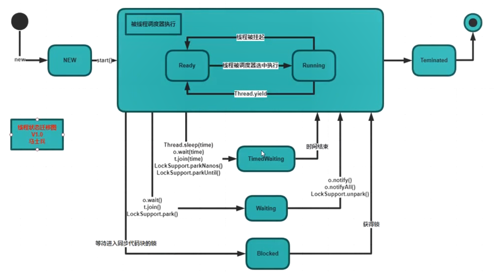
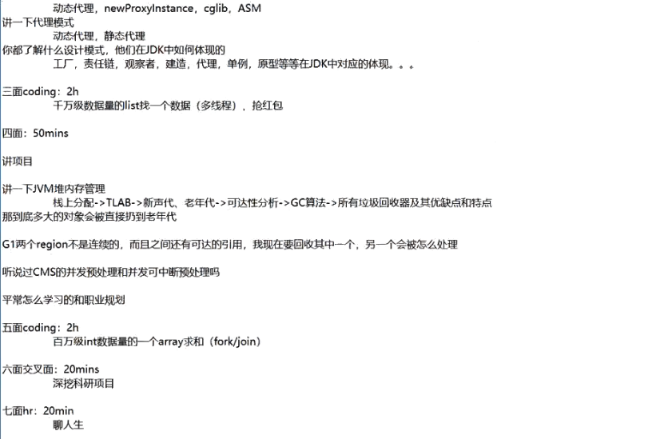
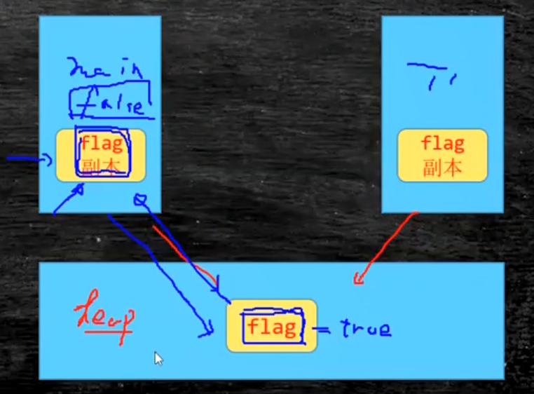
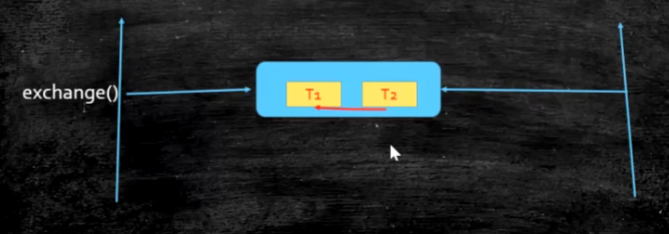

### 线程创建


### 常用线程方法


Thread.sleep 当前线程睡眠


t2.yield 当前线程回到就绪状态


t2.join 加入到t2线程，等待t2结束后回到本线程继续运行。【自己调用自己的join方法没有意义】

​	保证执行顺序。


stop 和 interrupt 不建议用


getState 获取线程状态


### **线程状态迁移图**




### **synchronized**

1. **synchronized(this)** / synchronized修饰实例方法：锁定当前对象

2. synchronized static xxx 修饰静态方法：相当于 **synchronized(T.class)**，锁定当前类的Class对象


synchronized修饰静态方法，锁的是当前类的Class对象（T.Class）

>  字节码文件（.class）被加载到内存时会生成一个与之对应的 Class类对象，


#### **底层原理**

Hotspot：对象头部有64位，其中2位表示该对象是否被锁定

jvm：


- markword


《我就是厕所所长》一、二

#### **锁升级**

1. 偏向锁（刚开始只有一个线程访问某个对象时，该对象只记录线程的ID）

2. 自旋锁(多个线程访问同一个对象，锁升级为自旋锁。占cpu，用户态，自旋10次)，使用场景：执行时间短、线程少

3. 重量级锁(OS级别的系统锁，不占cpu)，使用场景：执行时间长、线程多


“加了synchronized就不用加 volatile了”

因为 synchronized 既保证了**原子性** 又保证了 **可见性**

 

访问同步方法时不影响非同步方法的访问


synchronized是**可重入锁**

一个同步方法可以调用另外一个同步方法。一个线程已经拥有某个对象的锁，再次申请的时候仍然会得到该对象的锁（内部会判断是不是一个线程）


产生异常时默认会释放锁，要想不被释放，要进行catch


sync(obj)

其中的 obj 不能用 String、Integer、Long等基础类型


> https://github.com/bjmashibing/JUC


---


### **阿里七面**




**校招必须要刷题！**


### volatile

可变的、易变的

1. 保证线程可见性
2. 禁止指令重排列

 

**保证线程可见性**

堆内存为所有线程共享，每个线程都有自己的工作空间。

线程拷贝堆中对象在自己空间内生成一个**副本**，副本写回堆内存的时间不定。

由此产生了线程不可见。



volatile解决了此问题。线程每次访问对象时都会读写堆内存。


- MESI
- 缓存一致性协议。cpu级别 


**禁止指令重排列**

禁止不了CPU级别的指令重排序，禁止 JVM级别的重排序。


- loadfence原语指令
- storefence原语指令


#### **单例模式 sington**

1. 饿汉式。类加载时创建对象

```java
/**
 * 饿汉式
 * 类加载时实例化一个单例，JVM保证线程安全。（Class.forName("")）
 * 推荐使用！
 */
public class T1 {

    private static final Object INSTANCE = new Object();

    private T1(){
    }

    public static Object getInstance(){
        return INSTANCE;
    }

}
```

2. 懒汉式。访问时创建对象。

```java
/**
 * 懒汉式：按需实例化
 * 存在线程安全问题
 */
public class T2 {

    private static Object INSTANCE = null;

    private T2(){
    }

    public static Object getInstance(){
        if (INSTANCE==null){
            //模拟业务操作
            try {
                Thread.sleep(1);
            } catch (InterruptedException e) {
                e.printStackTrace();
            }

            INSTANCE = new Object();
        }
        return INSTANCE;
    }

    public static void main(String[] args) {
        for (int i=0; i<100; i++){
            new Thread(()->
                    System.out.println(T2.getInstance().hashCode())).start();
        }
    }

}
```


- 多线程环境下，需要保证线程安全


通过synchronized锁  getInstance方法，相当于 synchronized(T2.class)，效率下降

```java
    public synchronized static Object getInstance(){
        if (INSTANCE==null){
            //模拟业务操作
            try {
                Thread.sleep(1);
            } catch (InterruptedException e) {
                e.printStackTrace();
            }

            INSTANCE = new Object();
        }
        return INSTANCE;
    }
```


锁细化。双重检查

```java
public class T3 {

    private static Object INSTANCE = null;

    private T3(){
    }

    public static Object getInstance(){

        if (INSTANCE == null) {
            //可能有多个线程进入此if语句
            synchronized (Object.class){

                if (INSTANCE==null){//双重检查！
                    try {
                        Thread.sleep(1);//模拟业务
                    } catch (InterruptedException e) {
                        e.printStackTrace();
                    }

                    INSTANCE = new Object();
                }
            }
        }

        return INSTANCE;
    }
}
//高并发情况下，很难出现错误。
//超高并发（阿里京东秒杀）时可能会出错。
```


> 面试题：你听说过单例模式吗？单例模式中有一种叫做双重检查，你了不了解？单例要不要加 volatile？


**双重检查** 时需要添加 volatile。

new对象时分为三部，1申请空间，2初始化，3将地址赋值给成员。

出现的问题：超高并发下，三个步骤顺序可能会出错，添加volatile 保证三个步骤顺序执行，进而保证线程安全

加了volatile之后，保证初始化完之后才进行赋值。


强测。ASM修改代码。


synchronized 只能保证原子性，不能禁止指令重排列。


synchronized锁优化

- 锁细化。比如锁方法改为锁变量。不是越细越好。
- 锁粗化。太多细琐时，可换成大锁


sync(obj){}

其中 obj 对象不能改变，通常使用 final修饰obj。

obj 不能是String、Integer、Long等类型


### CAS

- 无锁（也叫乐观锁）优化，自旋

**Compare And Set**

```java
cas(V, Expected, Newvalue){//V=variable
    if V==E;V=New;
    otherwise try-again-or-failed;//不断重试，或者放弃
}
```

- 会产生 `ABA` 问题

```tex
将A改为B，之后将B又改为A
```

解决方法：

1. 加版本号 （使用 AtomicStampReference）
2. 加标记


#### 原子类 AtomicXXX

- 在 java.util.concurrent.atomic   

- 原子类的原理是 CAS，使用 **unsafe.compareAndSwapXXX** 实现 CAS
- 使用 volatile


所有CAS在 Java中的支持类：**`Unsafe`** 

> https://www.jianshu.com/p/cda24891f9e4


AtomicInteger 原子类简单使用

```java
public class TestAtomicInteger {

    public AtomicInteger atomicInteger;

    public void m(){
        for (int i = 0; i < 10000; i++) {
            atomicInteger.getAndIncrement();//Atomically increments by one the current value.
        }
    }

    public static void main(String[] args) {
        TestAtomicInteger test = new TestAtomicInteger();
        test.atomicInteger = new AtomicInteger(0);

        List<Thread> list = new ArrayList<>();

        for (int i = 0; i < 10; i++) {
            list.add(new Thread(test::m));//lambda表达式
        }

        list.forEach((thread) -> thread.start());

        list.forEach((thread) ->{//等待10个线程执行完毕
                try {
                    thread.join();
                } catch (InterruptedException e) {
                    e.printStackTrace();
                }
        });

        System.out.println(test.atomicInteger.get());
    }

}
```


> 你确定你知道CAS？
> CAS：对于内存中的某一个值V，提供一个旧值A和一个新值B。如果提供的旧值V和A相等就把B写入V。这个过程是原子性的。
> CAS执行结果要么成功要么失败，对于失败的情形下一班采用不断重试。或者放弃。
>
> ABA：如果另一个线程修改V值假设原来是A，先修改成B，再修改回成A。当前线程的CAS操作无法分辨当前V值是否发生过变化。
>
> 关于ABA问题我想了一个例子：在你非常渴的情况下你发现一个盛满水的杯子，你一饮而尽。之后再给杯子里重新倒满水。然后你离开，当杯子的真正主人回来时看到杯子还是盛满水，他当然不知道是否被人喝完重新倒满。解决这个问题的方案的一个策略是每一次倒水假设有一个自动记录仪记录下，这样主人回来就可以分辨在她离开后是否发生过重新倒满的情况。这也是解决ABA问题目前采用的策略。
>
>
> 链接：https://www.zhihu.com/question/23281499/answer/24112589


> Atomic：https://baijiahao.baidu.com/s?id=1669397523505381576


比较不同同步方法高并发下递增时的效率。

1. Sync。
2. AtomicLong。
3. LongAdder。分段锁


### 基于 CAS 的其他锁


- 基于 **AQS** 实现 **AbstractQueuedSynchronizer，其中维护了一个FIFO队列**


#### **ReenTrantLock**

-  可重入锁，是否可以多次申请

synchronized是可重入锁

```java
synchronized void m1() {

    m2();//同一个线程调用m1后调用m2，不会再次申请锁。否则会造成死锁。另一个场景是 子类同步方法调用父类同步方法

}

synchronized void m2() {
    ///...
}
```


**Reentrantlock**

- 上锁解锁。lock和unlock。常放于 try-catch-finally中

- 尝试得到锁。tryLock()。可以指定时间。如果拿不到锁怎么办。

- lockInterruptly( )。除非该线程被中断，否则就获取锁。thread.interrupt() 
- 公平和非公平。
  - 非公平。如 synchronized，谁抢到是谁的。
  - 公平锁。先来后到，存在等待队列，一定程度上可看作是平均分配。*使用公平的排序策略*


其他使用：

1. isLocked() 是否被锁住

2. isHeldByCurrentThread() 当前线程是否持有

3. 方法 unlock()  释放锁。如果当前线程不是锁的持有者会报 IllegalMonitorStateException 异常


```java
public class TestLockInterruptibly {

    ReentrantLock lock = new ReentrantLock();

    void m1(){
        try {
            //如果当前线程已经持有锁，那么持有计数将增加1，该方法将立即返回。
            //如果锁被另一个线程持有，那么当前线程出于线程调度目的将被禁用，并处于休眠状态，直到获得锁，此时锁持有计数被设置为1。
            lock.lock();
            System.out.println("m1 acquired lock");
            Thread.sleep(Integer.MAX_VALUE);
        }catch (Exception e){
            e.printStackTrace();
        }finally {
            //需要使用 lock.isHeldByCurrentThread()，而非 isLocked()
            if (lock.isLocked()) {//最终需要释放锁。
                //注意此方法！！！
               // If the current thread is not the holder of this lock then IllegalMonitorStateException is thrown.
               lock.unlock();
            }
        }
    }

    void m2(){
        try {
            //Acquires the lock unless the current thread is interrupted.
            //除非该线程被中断，否则就获取锁
            lock.lockInterruptibly();
            System.out.println("m2....");
        }catch (Exception e){
            e.printStackTrace();
        }finally {
            if (lock.isHeldByCurrentThread()){
                lock.unlock();
            }
        }
    }

    public static void main(String[] args) {
        TestLockInterruptibly lock = new TestLockInterruptibly();
        Thread t1 = new Thread(lock::m1);
        Thread t2 = new Thread(lock::m2);

        t1.start();
        t2.start();

        try {
            Thread.sleep(100);
        } catch (InterruptedException e) {
            e.printStackTrace();
        }

        t2.interrupt();//中断 t2 线程

    }

}
```


#### **CountDownLatch**

- “倒计时门闩”


latch.await()  当前线程 **等待，直到计数为零**，除非线程被中断。

latch.countDown()  计数减少，如果计数为零，释放所有等待线程。


> 参考：https://www.jianshu.com/p/e233bb37d2e6


#### CyclicBarrier

- ”循环障碍“。


CyclicBarrier(int,Runnable)

cb.await()  等待所有线程到达然后继续执行


- 简单测试

```java
public class TestCyclicBarrier {

    public static void main(String[] args) {

        CyclicBarrier cb = new CyclicBarrier(20, ()-> System.out.println("坐好扶好，马上发车！"));

        for (int i = 0; i < 40; i++) {

            new Thread(()->{
                try {
                    cb.await();//等待所有线程到达然后继续执行

                    System.out.println("arrive.. ...");
                }catch (Exception e){
                    e.printStackTrace();
                }
            }).start();

        }

    }

}
/*
	40个线程，每一组20个，一个组中所有线程到达后继续执行。故输出40个“arrive.. ...”，2个“坐稳扶好...”
	如果是39个线程，则输出20个“arrive.. ...”，1个“坐稳扶好...”
*/
```


#### Phaser


- 遗传算法


phaser.bulkRegister(int)  指定线程数量

phaser.arriveAndAwaitAdvance()  线程到此处时等待前进

phaser.arriveAndDeregister()  线程到达后注销自己，parites减1


基本没被问到


#### ReadWriteLock

共享锁和排它锁。（互斥锁=排它锁）

读锁可共享，写锁不可共享。（可以同时读，不可同时写）

效率大大提升。

```java
public class TestReadWriteLock {
//    static ReentrantLock lock = new ReentrantLock();

    static ReentrantReadWriteLock lock = new ReentrantReadWriteLock();
    static ReentrantReadWriteLock.ReadLock readLock = lock.readLock();
    static ReentrantReadWriteLock.WriteLock writeLock = lock.writeLock();
    static int count=0;

    static void read(Lock lock){
        try {
            lock.lock();
            Thread.sleep(500);
            System.out.println("read.. ..");
        }catch (Exception e){
            e.printStackTrace();
        } finally{
            lock.unlock();
        }
    }

    static void write(Lock lock){
        try {
            lock.lock();
            Thread.sleep(500);
            System.out.println("write.. ..");
        }catch (Exception e){
            e.printStackTrace();
        } finally{
            lock.unlock();
        }
    }

    public static void main(String[] args) {

        Runnable readR = () -> read(readLock);//可共享
        Runnable writeR = () -> write(writeLock);//不可共享

        for (int i = 0; i < 18; i++) {
            new Thread(readR).start();
        }
        for (int i = 0; i < 2; i++) {
            new Thread(writeR).start();
        }

    }

}
```


【分布式锁：面试必会】


#### Semaphore

信号量


Semaphore(int)  指定信号值

sem.acquire()  获取信号量，值减一。如果信号值为0则阻塞

> Acquires a permit from this semaphore, blocking until one is available, or the thread is interrupted.

sem.release()  释放信号量，值加一。

> Releases a permit, returning it to the semaphore.


**做限流**


#### Exchanger


基本没被问到

两个线程之间交换数据。




调用 exchange方法时阻塞。等待另一个线程exchange。

执行完之后继续向下执行。

```java
public class TestExchanger {

    static Exchanger<String> exchanger = new Exchanger<>();//交换String类型

    public static void main(String[] args) {

        new Thread(()->{
            String s = "T1";
            try {
                s = exchanger.exchange(s);//交换。返回交换结果
            } catch (InterruptedException e) {
                e.printStackTrace();
            }
            System.out.println(Thread.currentThread().getName()+" "+s);
        }, "t1").start();

        new Thread(()->{
            String s = "T2";
            try {
                s = exchanger.exchange(s);
            } catch (InterruptedException e) {
                e.printStackTrace();
            }
            System.out.println(Thread.currentThread().getName()+" "+s);
        }, "t2").start();

    }

}
```


实战java高并发程序设计。葛一鸣


面试题：锁的分类以及java实现

> 乐观锁、悲观锁、自旋锁、读写锁（排它锁、共享锁）、分段锁
>
> CAS、   sync、  CAS、ReadWriteLock、LongAddr/concurrenthashmap


