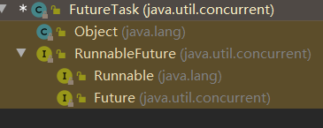
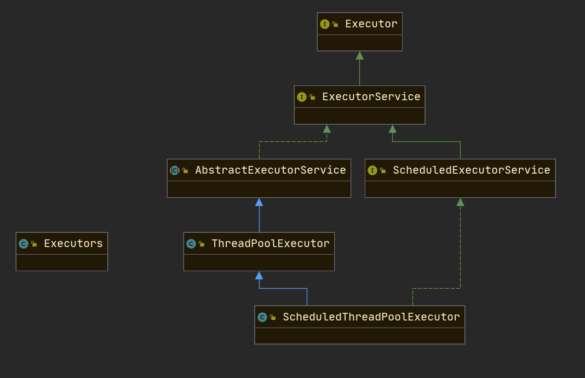
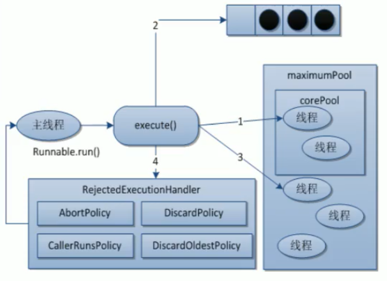
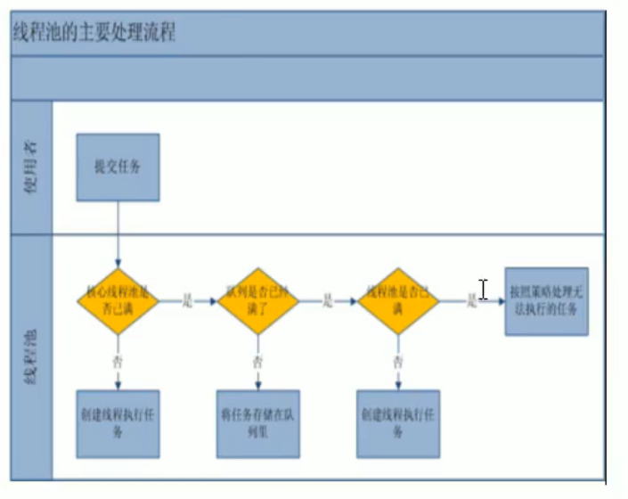
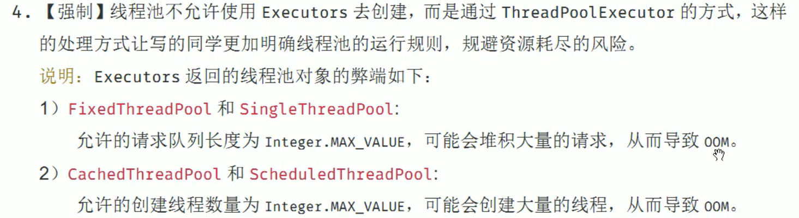

### Callable\<V>

> Thread(Runnable runnable)

> Callable 接口与 Runnable 类似，因为两者都是为那些实例可能由另一个线程执行的类而设计的。 但是，Runnable 不返回结果，也不能抛出已检查的异常。

适配器模式



```java
public class AboutCallable {

    public static void main(String[] args) throws ExecutionException, InterruptedException {

        FutureTask<Integer> task = new FutureTask<>(new MyThread());
        Thread thread = new Thread(task);
        thread.start();
        System.out.println("get from task: " + task.get());

    }

}

class MyThread implements Callable<Integer> {

    @Override
    public Integer call() throws Exception {
        System.out.println(Thread.currentThread().getName() + " in call().");
        return 1024;
    }

}
```


> 好处：非阻塞，fork/join，大数据情况下
>
> 调用者在调用 futrueTask.get() 获取结果时会阻塞，因此最好将 get 方法**放在最后**（此时可理解为非阻塞）
>
> 可以通过 futureTask.isDone() 判断任务是否完成

> 注意：一个 futureTask 实例只能被执行一次，多个线程同时执行一个 futureTask，只有最先拿到的线程会执行，其他的线程不会执行，因为他们做的工作是一样的
>
> ```java
> FutureTask<Integer> task = new FutureTask<>(new MyThread());
> new Thread(task, "A").start();
> new Thread(task, "B").start();//B不会执行
> 
> Integer res = task.get();
> System.out.println("get from task: " + res);
> ```
>
> 


### 线程池


> 核心数
>
> ```java
> System.out.println(Runtime.getRuntime().availableProcessors());
> ```
>
> 


技术架构




有几种线程池？

> 使用 Executors 创建
>
> ```java
> ExecutorService executorService1 = Executors.newSingleThreadExecutor();
> ExecutorService executorService2 = Executors.newFixedThreadPool(3);
> ExecutorService executorService3 = Executors.newCachedThreadPool();
> ```
>
> 底层源码：使用 **ThreadPoolExecutor** 进行创建，都是 **5** 个参数，核心是使用的是**阻塞队列**
>
> ```java
> public static ExecutorService newSingleThreadExecutor() {
>  return new FinalizableDelegatedExecutorService
>      (new ThreadPoolExecutor(1, 1,
>                              0L, TimeUnit.MILLISECONDS,
>                              new LinkedBlockingQueue<Runnable>()));
> }
> 
> public static ExecutorService newFixedThreadPool(int nThreads) {
>  return new ThreadPoolExecutor(nThreads, nThreads,
>                                0L, TimeUnit.MILLISECONDS,
>                                new LinkedBlockingQueue<Runnable>());
> }
> 
> public static ExecutorService newCachedThreadPool() {
>  return new ThreadPoolExecutor(0, Integer.MAX_VALUE,
>                                60L, TimeUnit.SECONDS,
>                                new SynchronousQueue<Runnable>());
> }
> ```
>

> 同步队列 SynchronousQueue
>
> 放一个就不能放第二个了，队列中最多只能有一个元素

> 其他线程池：（问的少）
>
> - Executors.newScheduledThreadPool()
>
> - Executors.newWorkStealingPool(int)     java8新出

> 使用场景：
>
> | fixed  | 长期的任务，性能好很多                     |
> | ------ | ------------------------------------------ |
> | single | 一个任务一个任务执行                       |
> | cached | 执行很多短期异步的小程序或负载较轻的服务器 |


### 7大参数⭐


```java
public ThreadPoolExecutor(int corePoolSize,
                          int maximumPoolSize,
                          long keepAliveTime,
                          TimeUnit unit,
                          BlockingQueue<Runnable> workQueue,
                          ThreadFactory threadFactory,
                          RejectedExecutionHandler handler) {}
```


| 参数            | 含义                                                         |
| --------------- | ------------------------------------------------------------ |
| corePoolSize    | 线程池中的常驻核心线程数                                     |
| maxinumPoolSize | 线程池能够容纳同时执行的最大线程数，此值必须大于等于1        |
| keepAliveTime   | 多余的空闲线程的存活时间。<br />当前线程池数量超过 corePoolSize 时，当空闲时间达到 keepAliveTime 时，<br />多余的线程会被销毁直到只剩下 corePoolSize 个线程为止。 |
| unit            | keepAliveTime 的单位                                         |
| workQueue       | 任务队列，被提交但尚未被执行的任务                           |
| threadFactory   | 表示生成线程池中工作线程的线程工厂，用于创建线程**一般用默认即可**。 |
| handler         | 拒绝策略，标识当队列满了并且工作线程大于等于线程池的最大线程数(maxinumPoolSize)时如何来拒绝请求执行的 runnable 的策略。 |


### 线程池的底层工作原理








具体流程：⭐⭐

1. 在创建了线程池后，等待提交过来的任务请求。

2. 当调用 execute() 方法添加一个请求任务时，线程池会做如下判断:

   1. 如果正在运行的线程数量小于 corePoolSize，那么马上创建线程运行这个任务;
   2. 如果正在运行的线程数量大于或等于 corePoolSize，那么将这个任务**放入队列;**
   3. 如果这时候队列满了且正在运行的线程数量还小于 maximumPoolSize，那么还是要创建非核心线程立刻运行这个任务;
   4. 如果队列满了且正在运行的线程数量大于或等于 maximumPoolSize，那么线程池**会启动饱和拒绝策略来执行。**


3. 当一个线程完成任务时，它会从队列中取下一个任务来执行。

4. 当一个线程无事可做超过一定的时间（keepAliveTime）时，线程池会判断:
         如果当前运行的线程数大于 corePoolSize，那么这个线程就被停掉。
         所以线程池的所有任务完成后它**最终会收缩到 corePoolSize 的大小。**


### 谈谈线程池的拒绝策略

生产中如何配置？


> 拒绝策略接口
>
> ```java
> public interface RejectedExecutionHandler {
>     void rejectedExecution(Runnable r, ThreadPoolExecutor executor);
> }
> ```

1. AbortPolicy(默认)：直接抛出 RejectedExecutionException异常阻止系统正常运行。
2. CallerRunsPolicy："调用者运行"一种调节机制，该策略既不会抛弃任务，也不会抛出异常，而是将某些任务退到调用者，从而降低新任务的流量。
3. DiscardOldestPolicy：抛弃队列中等待最久的任务，然后把当前任务加入队列中尝试再次提交当前任务。
4. DiscardPolicy：直接丢弃任务，不予任何处理也不抛出异常。如果允许任务丢失，这是最好的一种方案。


> 面试官：工作中用提供的哪个线程池？

哪个都不用，:triangular_flag_on_post: 避坑





> 面试官： 用过线程池吗？有哪些问题？


```java
ThreadPoolExecutor threadPoolExecutor = new ThreadPoolExecutor(
        2,
        5,
        1L,
        TimeUnit.SECONDS,
        new LinkedBlockingDeque<>(3),
        Executors.defaultThreadFactory(),
        new ThreadPoolExecutor.AbortPolicy()
);
```

线程工厂：

- 使用默认的 Executors.defaultThreadFactory()

拒绝策略的选取：

- AbortPolicy 会直接抛异常中断程序


**如何合理配置线程数？**


> CPU密集型

任务需要大量运算，没有阻塞，CPU一直全速运行。

只有在**真正的多核CPU**上才可能得到加速（通过多线程）

配置数量：（CPU核数+1）个线程


> IO密集型

> 方案一：
>
> 由于IO密集型任务线程并不是一直在执行任务，则应配置尽可能多的线程，比如 CPU核数*2

> 方案二：
>
> IO密集型，即该任务需要**大量的IO**，即**大量的阻塞**。
>
> 在单线程上运行IO密集型的任务会导致浪费大量的CPU运算能力在等待上。
>
> 所以在IO密集型任务中使用多线程能可以大大的加速程序运行，即使在核心CPU上，这种加速**主要就是利用了被浪费掉的阻塞时间**。
>
> IO密集型时，大部分线程都阻塞，故需要多配置线程数
>
> 参考公式：CPU核数  /  (1 — 阻塞系数  )，阻塞系数在 0.8 ~ 0.9 之间
>
> 比如 8 核CPU：8   /   (1 — 0.9)  =  80 个线程


### 并发中的 死锁编码和定位分析


> 死锁是什么

死锁是指两个或两个以上的进程在执行过程中,因争夺资源而造成的一种**互相等待的现象**,，若无外力于涉那它们都将无法进下去。

如果系统资源充足，进程的资源请求都能够得到满足，死锁出现的可能性就很低，否则就会因争夺有限的资源而陷入死锁。


> 产生死锁的主要原因

1. 系统资源不足
2. 进车给运行推进的顺序不合适
3. 资源分配不当


> 写个死锁？分析一下？


```java
public static void main(String[] args) {
        
    Object obj1 = new Object();
    Object obj2 = new Object();

    new Thread(()->{
        synchronized (obj1) {
            System.out.println(Thread.currentThread().getName() + " 获取到了 obj1 锁");

            try { Thread.sleep(2000); } catch (Exception e) { } finally {}

            System.out.println(Thread.currentThread().getName() + " 准备获取 obj2 锁");
            synchronized (obj2) {

            }

        }
    }, "thread-A").start();

    new Thread(()->{
        synchronized (obj2) {
            System.out.println(Thread.currentThread().getName() + " 获取到了 obj2 锁");

            try { Thread.sleep(2000); } catch (Exception e) { } finally {}

            System.out.println(Thread.currentThread().getName() + " 准备获取 obj1 锁");

            synchronized (obj1) {

            }

        }
    }, "thread-B").start();

}
```


死锁排查：

1. 日志
2. 查看程序堆栈 jstack


> jps   -l     查看java进程
>
> jstack     查看java进程的堆栈信息


