## JVM Overview

### class loader subsystem

考点：

1. 类加载器
2. 双亲委派机制
3. java 类加载杀向安全机制
4. ...


### 虚拟栈、程序计数器、本地虚拟站

线程私有


### 堆区和方法区

- 方法区
  - java7 永久代
  - java8 元空间

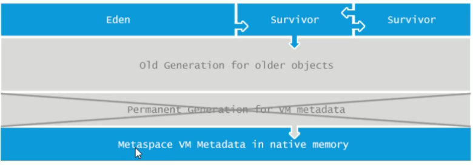

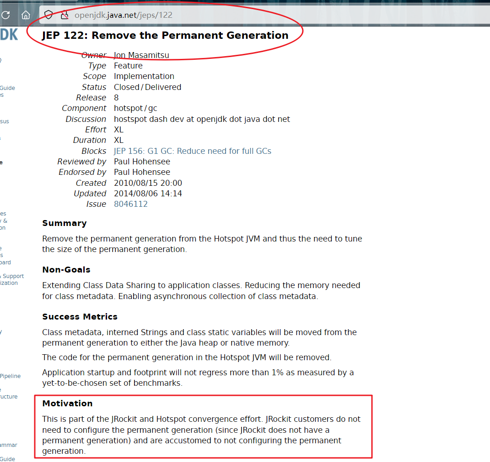

> Oracle收购了SUN公司和BEA公司，有两套规范，JRocket 和 Hotspot。
>
> 这是 JRockit 和 Hotspot 融合工作的一部分。 JRockit 客户不需要配置永久代（因为JRockit 没有永久代），习惯不配置永久代。
>
> 动机：两套规范合二为一，将永久代替换为元空间。


> Java8内存模型—永久代(PermGen)和元空间(Metaspace) https://www.cnblogs.com/paddix/p/5309550.html


### GC作用域

线程共享的内存空间，有 堆内存和方法区


### 常见垃圾回收算法


>1. 引用计数
>2. 复制
>3. 标记清除
>4. 标记整理
>
>
>
>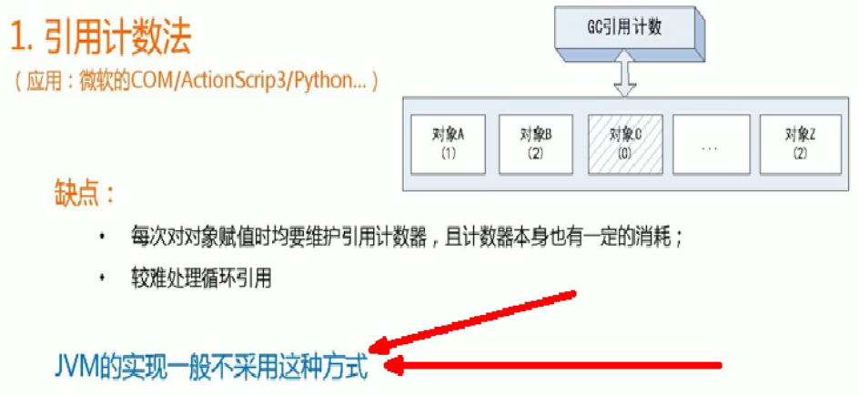
>
>
>
>**复制算法**，在年轻代用
>
>**复制之后有交换，谁空谁是 to**
>
>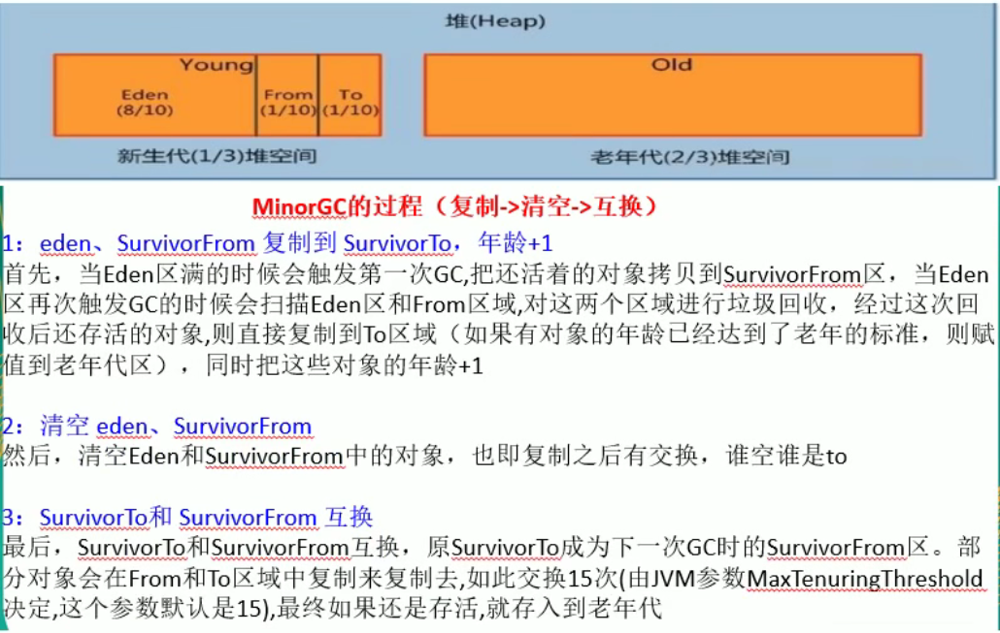
>
>优点：没有内存碎片
>
>缺点：浪费空间，大对象复制耗时
>
>
>
>**标记清除**，先标记后清除
>
>优点：简单，没有大面积复制性能高
>
>缺点：产生内存碎片
>
>
>
>
>
>**标记整理**，先标记后整理
>
>优点：既不浪费空间，又不产生碎片
>
>缺点：耗时多
>
>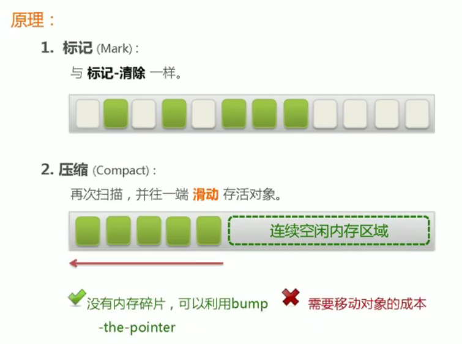

**新生代：复制算法**

**老生代：标记清除、标记压缩**

**没有最好的算法，各有优缺点**


## Real Power

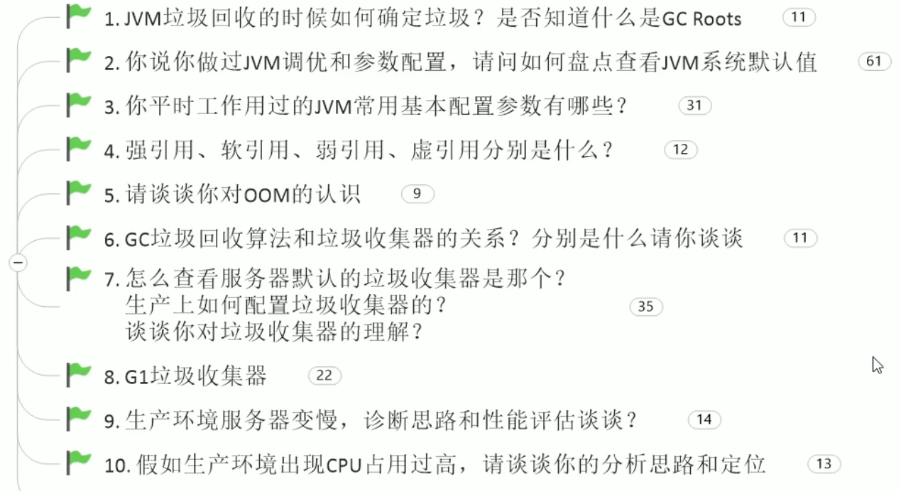


#### ① JVM垃圾回收的时候如何确定垃圾？是否知道什么是GC Roots？

> 什么是垃圾，内存中已经不再被使用到的空间就是垃圾，Person p1 = null

> 进行垃圾回收，如何判断一个对象是否可以被回收？

引用计数法

枚举根节点做可达性分析（根搜索路径）

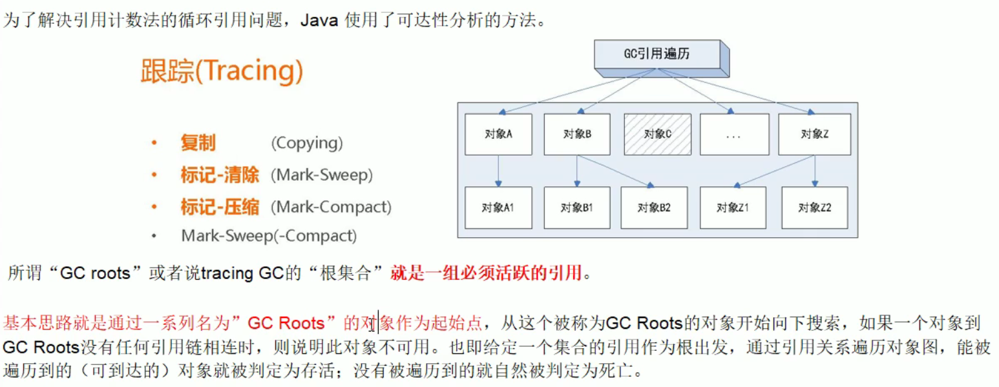

关键词：**引用链**、**可到达**

> Java 中可作为 GC Roots的对象有哪些？

* 虚拟机栈（栈帧中的局部变量区，也叫做**局部变量表**）中引用的对象
* 方法区中的**类静态属性**引用的对象
* 方法区中**常量**引用的对象
* 本地方法栈中JNI（Native方法）引用的对象

```java
public class GCROOTDemo {

    //类静态属性引用的对象
    private static GCROOTDemo gcrootDemo2 = new GCROOTDemo();

    //常量引用的对象
    private static final GCROOTDemo gcrootDemo3 = new GCROOTDemo();

    private static void m1() {
        //虚拟机栈的本地方法表引用的对象
        GCROOTDemo gcrootDemo1 = new GCROOTDemo();
    }

    public static void main(String[] args) {
        m1();
    }

}
```


**本题重点**：`根节点可达性分析`，`GC ROOTs`


#### ② 你说过你做过 JVM 调优和参数配置，请问如何盘点查看 JVM 系统默认值？


> -Xms、-Xmx、-Xss ....
>
> 从多少调节到多少，默认值是什么样的


##### 大致分类


> JVM的参数类型有哪些？⭐

1. 标配参数（了解）
2. X 参数（了解）
3. **XX 参数**


> **标配参数**
>
> java -version
>
> java -help
>
> 
>
> **X参数**
>
> - -Xint                          解释执行
> - -Xcomp                     编译执行，第一次执行就编译成本地代码
> - -Xmixed                     混合执行（默认）
>
> > C:\Users>java -version
> > java version "1.8.0_40"
> > Java(TM) SE Runtime Environment (build 1.8.0_40-b25)
> > Java HotSpot(TM) 64-Bit Server VM (build 25.40-b25, mixed mode)                         默认混合模式
> >
> > C:\Users>java -Xint -version
> > java version "1.8.0_40"
> > Java(TM) SE Runtime Environment (build 1.8.0_40-b25)
> > Java HotSpot(TM) 64-Bit Server VM (build 25.40-b25, interpreted mode)
> >
> > C:\Users>java -Xcomp -version
> > java version "1.8.0_40"
> > Java(TM) SE Runtime Environment (build 1.8.0_40-b25)
> > Java HotSpot(TM) 64-Bit Server VM (build 25.40-b25, compiled mode)
> >
> > C:\Users>java -Xmixed -version
> > java version "1.8.0_40"
> > Java(TM) SE Runtime Environment (build 1.8.0_40-b25)
> > Java HotSpot(TM) 64-Bit Server VM (build 25.40-b25, mixed mode)
>
> 
>
> **XX参数**
>
> - 布尔类型
> - 键值类型
>
> 
>
> > **布尔类型**
> >
> > 格式：`-XX:+` 或者 `-XX:-`
> >
> > 含义：`+` 表示开启、`-` 表示关闭
> >
> > 例子：
> >
> > - 是否打印GC收集细节。`-XX:+PrintGCDetails` 或 `-XX:-PrintGCDetails`
> > - 是否使用串行垃圾回收器  `-XX:-UseSerialGC` 或 `-XX:+UseSerialGC`
> >
> > > 如何查看一个正在运行中的Java程序，它的**某个JVM参数**是否开启？具体值是多少？
> > >
> > > 使用 `jps` 和 `jinfo`，后者用来查看程序的运行信息
> > >
> > > 具体使用：`jps -l ` 查看程序，`jinfo -flag  PrintGCDetails  13632` 查看进程的参数信息
> > >
> > > ```
> > > C:\Users\HiWin10>jinfo -flag PrintGCDetails 6476
> > > -XX:-PrintGCDetails
> > > ```
> > >
> > > 配置VM参数：
> > >
> > > 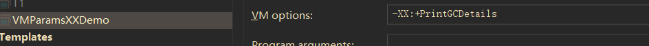
> > >
> > > 重新查看：
> > >
> > > ```
> > > C:\Users\HiWin10>jinfo -flag PrintGCDetails 1460
> > > -XX:+PrintGCDetails
> > > ```
> >
> > 
> >
> > **键值类型**
> >
> > 格式：`-XX:属性=属性值`
> >
> > 例子：
> >
> > - 元空间大小 `-XX:MetaspaceSize=128m`
> > - 新生代需要经历多少次GC晋升到老年代中的最大阈值 `-XX:MaxTenuringThreshold=15`
> >
> > > 默认值
> > >
> > > ```
> > > C:\Users\HiWin10>jinfo -flag MetaspaceSize 8984
> > > -XX:MetaspaceSize=21807104                  21M左右
> > > ```
> > >
> > > 进行配置
> > >
> > > 
> > >
> > > 再次查看 
> > >
> > > ```
> > > C:\Users\HiWin10>jinfo -flag MetaspaceSize 6152
> > > -XX:MetaspaceSize=1073741824               1g左右
> > > ```
> > >
> > > ```
> > > C:\Users\HiWin10>jinfo -flag MaxTenuringThreshold 6152
> > > -XX:MaxTenuringThreshold=15
> > > ```
> > >
> > > 


后话：知道虚拟机参数，就知道微服务发布到 tomcat或undertow 上怎么配置性能最高


查看所有参数：`jinfo -flags 10004`

```
C:\Users\HiWin10\Desktop\notes\java基础>jinfo -flags 10004
Attaching to process ID 10004, please wait...
Debugger attached successfully.
Server compiler detected.
JVM version is 25.40-b25
Non-default VM flags: -XX:CICompilerCount=4 -XX:InitialHeapSize=134217728 -XX:MaxHeapSize=2118123520 -XX:MaxNewSize=705691648 -XX:MetaspaceS
ize=1073741824 -XX:MinHeapDeltaBytes=524288 -XX:NewSize=44564480 -XX:OldSize=89653248 -XX:+PrintGCDetails -XX:+UseCompressedClassPointers -X
X:+UseCompressedOops -XX:+UseFastUnorderedTimeStamps -XX:-UseLargePagesIndividualAllocation -XX:+UseParallelGC
Command line:  -XX:+PrintGCDetails -XX:MetaspaceSize=1024m -javaagent:E:\JetBrains\IntelliJ IDEA 2020.1\lib\idea_rt.jar=8581:E:\JetBrains\In
telliJ IDEA 2020.1\bin -Dfile.encoding=UTF-8
```


**坑题：**问完 `-XX:` 两大类型参数后，问 `-Xms、-Xms` 是什么类型？

`-Xms` 是 `-XX:InitialHeapSize`的简写

`-Xmx` 是 `-XX:MaxHeapSize` 的简写

因为比较常用，所以可以使用简写更加方便。

> 补充：-Xmn -Xms -Xmx -Xss 年轻代 最小堆 最大堆 栈空间


##### 盘点默认参数 ⭐

⭐查看参数默认值 `java -XX:+PrintFlagsInitial`

⭐查看修改过后的参数值 `java -XX:+PrintFlagsFinal -version`


查看配置：关于 `=` 与 `:=`，前者表示默认，后者表示被改过（人为改动或者JVM改动）

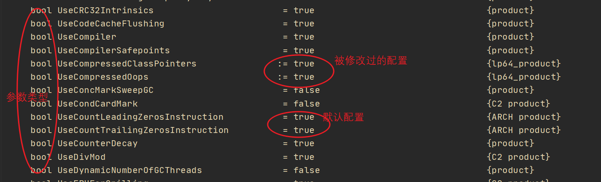

验证上边关于 `:=` 和 `=` 说法的正确性：

```markdown
java -XX:+PrintFlagsFinal -version ①
java -XX:+PrintFlagsFinal -XX:MetaspaceSize=512m Test ②

运行查看两个程序的 `MetaspaceSize` 参数配置：
①    uintx MetaspaceSize   = 21807104   
②	 uintx MetaspaceSize  := 536870912
```


⭐查看命令行参数：`-XX:+PrintCommandLineFlags`

```
C:\Users\HiWin10\Desktop\v>java -XX:+PrintCommandLineFlags -version
-XX:InitialHeapSize=132318784
-XX:MaxHeapSize=2117100544
-XX:+PrintCommandLineFlags
-XX:+UseCompressedClassPointers 
-XX:+UseCompressedOops 
-XX:-UseLargePagesIndividualAllocation 
-XX:+UseParallelGC
java version "1.8.0_40"
Java(TM) SE Runtime Environment (build 1.8.0_40-b25)
Java HotSpot(TM) 64-Bit Server VM (build 25.40-b25, mixed mode)
```


#### ③ 你平时工作用过的 JVM 常用基本配置参数有哪些？⭐⭐

> 说出这些基本就够了：
>
> -Xms、-Xmx、-Xss、-Xmn
>
> -MetaspaceSize、-XX:+PrintGCDetails
>
> -XX:SurvivorRatio、-XX:NewRatio、-XX:MaxTenuringThreshold

基本的 `-Xms -Xmx` 需要掌握

- `-Xms` 初始内存大小，默认为物理内存的 1/64，等价于 `-XX:InitialHeapSize`
- `-Xmx` 最大分配内存，默认为物理内存的 1/4，等价于 `-XX:MaxHeapSize`

基础复习：

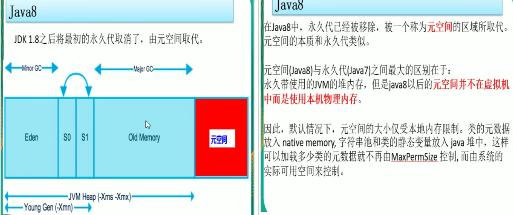


小案例：**-Xms 和 -Xmx 默认值的得来**

```java
public class DefaultSizeDemo {
    public static void main(String[] args) {
        long totalMemory = Runtime.getRuntime().totalMemory();
        long maxMemory = Runtime.getRuntime().maxMemory();

        //约占物理总内存的64分之一
        System.out.println("totalMemory(-Xms 默认): " + totalMemory + "字节、" + 
                           (totalMemory) / (double) 1024 / 1024 + "兆");

        //约占物理总内存的4分之一（4.4？）
        System.out.println("maxMemory(-Xmx 默认): " + maxMemory + "字节、" + 
                           (maxMemory) / (double) 1024 / 1024 + "兆");
    }
}
```


`-Xss` 设置单个线程栈的大小，一般默认为 512K~1024K，等价于 `-XX:ThreadStackSize`

https://docs.oracle.com/javase/8/docs/technotes/tools/windows/java.html

> 使用 jinfo 查看某个线程的栈空间大小，可能为 0，实际是 0 吗？
>
> 不是，0 表示使用系统默认，可以进行设置 -Xss512k 进行覆盖


`-Xmn` 设置年轻代大小，一般不做改动


`-MetaspaceSize` 设置元空间大小

元空间的本质和永久代类似，都是对 JVM 规范中方法区的实现。

不过元空间与永久代之间最大的区别在于：元空间并不在虚拟机中，而是使用**本地内存**。因此，默认情况下，元空间的大小仅受本地内存限制。

小疑惑：OOM 异常中的 Metaspace 报错是怎么回事？

使用：`-Xms10m -Xmx10m -XX:MetaspaceSize=1024m -XX:+PrintFlagsFinal`


**典型设置案例** ⭐

查看默认配置：`java -XX:+PrintCommandLineFlags -version`

```
-XX:InitialHeapSize=132318784 
-XX:MaxHeapSize=2117100544 
-XX:+PrintCommandLineFlags 
-XX:+UseCompressedOops
-XX:+UseCompressedClassPointers
-XX:-UseLargePagesIndividualAllocation 
-XX:+UseParallelGC
```

常用的默认配置：

`   -Xms128m -Xmx4096m -Xss1024k -XX:MetaspaceSize=512m -XX:+PrintCommandLineFlags -XX:+PrintGCDetails -XX:+UseSerialGC   `

```
-XX:InitialHeapSize=134217728
-XX:MaxHeapSize=4294967296
-XX:ThreadStackSize=1024
-XX:MetaspaceSize=536870912
-XX:+PrintCommandLineFlags
-XX:+PrintGCDetails
-XX:+UseCompressedClassPointers
-XX:+UseCompressedOops
-XX:-UseLargePagesIndividualAllocation
-XX:+UseSerialGC
```


`-XX:+PrintGCDetails` 输出 GC 详细的日志信息 ⭐⭐

GC 日志解读：

**① young gc**

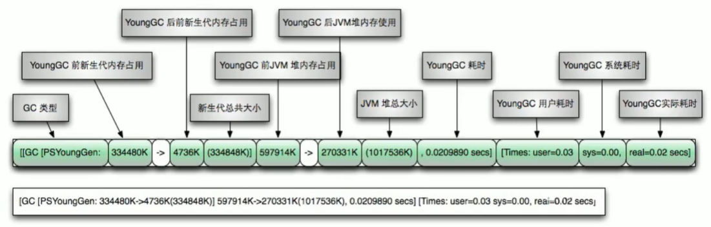

**② full gc**

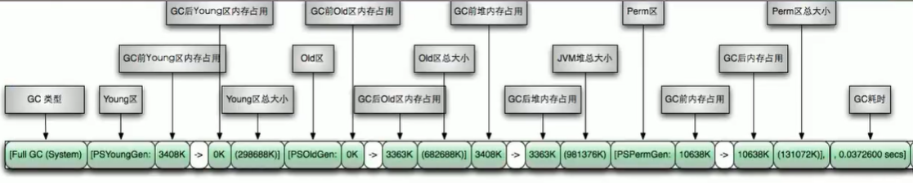

注意：jdk1.7 以前方法去是 Perm，jdk1.8 是 Metaspace

**GC 日志规律：**

 


`-XX:SurvivorRatio` 设置新生代中 eden 和 s0/s1 空间的比例

默认 **-XX:SurvivorRatio=8** 表示 Eden:S0:S1=8:1:1

可配置 **-XX:SurvivorRatio=4** 表示 Eden:S0:S1=4:1:1

SurvivorRatio 值就是设置 eden 区的比例占多少，s0/s1 相同


`-XX:NewRatio `  配置年轻代与老年代在堆结构的占比

默认 **-XX:NewRatio=2** 新生代:老年代=1:2，年轻代占整个堆的 1/3

可配置 **-XX:NewRatio=4** 新生代:来年代=1:4，年轻代占整个堆的 1/5

NewRatio 值就是设置老年代的占比，剩下的 1 给新生代

一般不会调，新生代配的太小会导致频繁 young gc。


`-XX:MaxTenuringThreshold`  设置垃圾的最大年龄。

默认为 15，即对象在新生代逃过 15 次才会进入老年代。设置为 0 不经过 S 区直接到到 old 区，适用于那些场合？


#### ④ 谈谈你对强引用、软引用、弱引用、虚引用的理解？


引用框架

 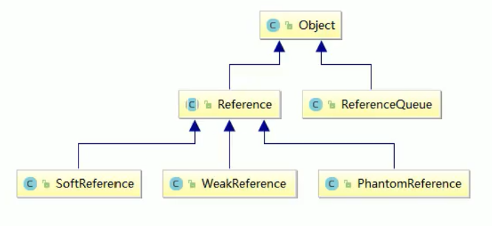

**强引用** 是默认的引用类型。

当内存不足时，JVM 开始垃圾回收，对于强引用，**就算是出现了 OOM 也不会对该对象进行处理，死都不收**。

是我们最常见的普通对象引用，只要还有强引用指向一个对象，就表明对象还“活着”，垃圾收集器就不会收集这种对象。

Java 中将一个对象赋给一个引用变量，这个引用变量就是一个强引用。当一个对象被强引用变量引用时，它处于可达状态，不可能被垃圾回收机制回收，即使该对象以后永远都会被用到 JVM 也不会回收。因此强引用是造成内存泄漏的主要原因之一。


