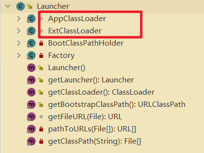

### JVM


java：跨平台的语言

**JVM：跨语言的平台。可以支持很多语言。**

可以理解为一种规范，只认识 .class文件并对其进行解读

- “JVM和java是没有关系的”，他们通过 class文件联系在一起


**JVM是一种规范**

虚构出来的一台计算机

- 字节码指令集（独自的汇编语言）
- 内存管理（堆栈方法区等）


> 查阅不同版本 java和JVM规范：https://docs.oracle.com/javase/specs/


了解 java文件 **编译**成 class文件的过程。【编译原理】


hotspot商业 不等于 不能下载

- 开源版本 openjdk


jre 和 jdk


#### 小工具

查看16进制格式的ClassFile

- sublime/notepad
- idea插件 BinEd

观察ByteCode

- javap命令。比如 javap -v xxxx/xx.class
- JBE
- idea插件 JClassLib


### ClassFile


**文件结构**


- 对照 常量池表进行分析


#### 变量


#### 方法


#### 常量池表


#### 第一个程序

```java

package com.engure.useplugin;

public class T1 {
}

/////////====>反编译。自动添加构造方法

//
// Source code recreated from a .class file by IntelliJ IDEA
// (powered by FernFlower decompiler)
//

package com.engure.useplugin;

public class T1 {
    public T1() {
    }
}

```


**构造方法的实现：**


指令与其编码对应：

1. aload_0   2a     this压栈
2. invokespecial   b7     调用1号常量池中Object的init方法
3. return   b1       return


- JVM 一共有 两百多条指令。
- JVM 有 8条原子性操作。


一步一步进行验证


### 类加载链接初始化


#### class文件加载过程

**1. Loading。**

1. 双亲委派机制，主要为了保证安全

   ​	**破坏双亲委派机制**：重写 loadClass方法

   1. 《深入JVM》中...
   2. 补充：**tomcat 热加载 reload**，使用不同的 ClassLoader 加载不同类

2. lazy loading ；五种情况

3. ClassLoader 源码。
   1. loadClass()、findClass
   2. **自定义 ClassLoader重写findClass**及里边常用defineClass

**2. Linking**

1. Verification。校验字节码文件
2. Preparation。静态变量赋默认值。
3. Resolution。

**3. Initializing。**静态变量赋值为初始值。
**4. GC。**


class文件加载到内存：

- 生成**一个**与之对应的 **Class对象**

- 使用一个 `ClasLoader` 的子类加载的。查看：String.class.getClassLoader()


Method Area

- &lt; 1.8。permanent generation 永久代
- &ge; 1.8。metaspace


#### Loading


**类加载器**


- 注意：不是继承关系，存在 层次关系。**“委托给父加载器” 中的 “父” 不是指 继承关系**。父加载器 不是指 加载器的加载器

- 不是继承关系，也可以产生联系。关联关系做成员。


4个 **分层的** ClassLoader

- null（由C++实现）。加载核心类的类加载器。使用C++实现的Bootstrap模块
- ExtClassLoader。加载 ext/*.jar 的类加载器
- AppClassLoader。加载 classpath 指定的内容
- XXXClassLoader。自定义的类加载器


**双亲委派机制**


先从 子到父 在缓存中找。再从 父到子 进行加载。如果没找到抛 `ClassNotFound` 异常


> 面试题：为什么类加载过程需要使用 双亲委派？
>
> 主要为了保证安全


```java
public class T2 {
    public static void main(String[] args) {
        System.out.println(T2.class.getClassLoader());//app
        System.out.println(T2.class.getClassLoader().getClass().getClassLoader());
        //null。appClassLoader的类加载器
        
        System.out.println(T2.class.getClassLoader().getParent());//app的父加载器是ext
        System.out.println(T2.class.getClassLoader().getParent().getParent());//ext的父加载器是null
    }
}
```


阅读源码

**Launcher**

- 其内部类有 ClassLoader 的实现 AppClassLoader 和 ExtClassLoader



```java

public class Launcher {
    private static URLStreamHandlerFactory factory = new Launcher.Factory();
    private static Launcher launcher = new Launcher();
    private static String bootClassPath = System.getProperty("sun.boot.class.path");//boot类路径
    private ClassLoader loader;
    private static URLStreamHandler fileHandler;


///////////////////////////////


    static class AppClassLoader extends URLClassLoader {
            final URLClassPath ucp = SharedSecrets.getJavaNetAccess().getURLClassPath(this);

            public static ClassLoader getAppClassLoader(final ClassLoader var0) throws IOException {
                final String var1 = System.getProperty("java.class.path");//获取classpath路径
                final File[] var2 = var1 == null ? new File[0] : Launcher.getClassPath(var1);
                return (ClassLoader)AccessController.doPrivileged(new PrivilegedAction<Launcher.AppClassLoader>() {
                    public Launcher.AppClassLoader run() {
                        URL[] var1x = var1 == null ? new URL[0] : Launcher.pathToURLs(var2);
                        return new Launcher.AppClassLoader(var1x, var0);
                    }
                });
            }


        }


///////////////////////////

    static class ExtClassLoader extends URLClassLoader {

            private static File[] getExtDirs() {
                String var0 = System.getProperty("java.ext.dirs");//获取拓展类路径
                File[] var1;
                if (var0 != null) {
                    StringTokenizer var2 = new StringTokenizer(var0, File.pathSeparator);
                    int var3 = var2.countTokens();
                    var1 = new File[var3];

                    for(int var4 = 0; var4 < var3; ++var4) {
                        var1[var4] = new File(var2.nextToken());
                    }
                } else {
                    var1 = new File[0];
                }

                return var1;
            }
    }
    
}


```

查看不同类加载器加载的jar包

```java
public class Paths {
    public static void main(String[] args) {

        String s1 = System.getProperty("sun.boot.class.path");
        System.out.println(s1.replaceAll(";", "\n"));

        System.out.println("-----------------------");
        String s2 = System.getProperty("java.class.path");
        System.out.println(s2.replaceAll(";", "\n"));

        System.out.println("-----------------------");
        String s3 = System.getProperty("java.ext.dirs");
        System.out.println(s3.replaceAll(";", "\n"));

    }
}
/*
C:\Program Files\jdk8\lib\resources.jar
C:\Program Files\jdk8\lib\rt.jar
C:\Program Files\jdk8\lib\sunrsasign.jar
C:\Program Files\jdk8\lib\jsse.jar
C:\Program Files\jdk8\lib\jce.jar
C:\Program Files\jdk8\lib\charsets.jar
C:\Program Files\jdk8\lib\jfr.jar
C:\Program Files\jdk8\classes
-----------------------
C:\Program Files\jdk8\jre\lib\charsets.jar
C:\Program Files\jdk8\jre\lib\deploy.jar
C:\Program Files\jdk8\jre\lib\ext\access-bridge-64.jar
C:\Program Files\jdk8\jre\lib\ext\cldrdata.jar
C:\Program Files\jdk8\jre\lib\ext\dnsns.jar
C:\Program Files\jdk8\jre\lib\ext\jaccess.jar
C:\Program Files\jdk8\jre\lib\ext\jfxrt.jar
C:\Program Files\jdk8\jre\lib\ext\localedata.jar
C:\Program Files\jdk8\jre\lib\ext\nashorn.jar
C:\Program Files\jdk8\jre\lib\ext\sunec.jar
C:\Program Files\jdk8\jre\lib\ext\sunjce_provider.jar
C:\Program Files\jdk8\jre\lib\ext\sunmscapi.jar
C:\Program Files\jdk8\jre\lib\ext\sunpkcs11.jar
C:\Program Files\jdk8\jre\lib\ext\zipfs.jar
C:\Program Files\jdk8\jre\lib\javaws.jar
C:\Program Files\jdk8\jre\lib\jce.jar
C:\Program Files\jdk8\jre\lib\jfr.jar
C:\Program Files\jdk8\jre\lib\jfxswt.jar
C:\Program Files\jdk8\jre\lib\jsse.jar
C:\Program Files\jdk8\jre\lib\management-agent.jar
C:\Program Files\jdk8\jre\lib\plugin.jar
C:\Program Files\jdk8\jre\lib\resources.jar
C:\Program Files\jdk8\jre\lib\rt.jar
F:\Idea20210311_threads\out\production\07-jvm
E:\JetBrains\IntelliJ IDEA 2020.3.1\lib\idea_rt.jar
-----------------------
C:\Program Files\jdk8\lib\ext
C:\WINDOWS\Sun\Java\lib\ext
*/
```


##### 自定义类加载器


ClassLoader.java

```java
    protected Class<?> loadClass(String name, boolean resolve)//resolve是否经过解析(class文件)
        throws ClassNotFoundException
    {
        synchronized (getClassLoadingLock(name)) {
            // First, check if the class has already been loaded
            Class<?> c = findLoadedClass(name);
            if (c == null) {//如果缓存中没有，则去父加载器中加载
                long t0 = System.nanoTime();
                try {
                    if (parent != null) {
                        c = parent.loadClass(name, false);
                    } else {
                        c = findBootstrapClassOrNull(name);
                    }
                } catch (ClassNotFoundException e) {
                    // ClassNotFoundException thrown if class not found
                    // from the non-null parent class loader
                }

                if (c == null) {//父加载器找一圈也没找到，调用findClass
                    // If still not found, then invoke findClass in order
                    // to find the class.
                    long t1 = System.nanoTime();
                    c = findClass(name);

                    // this is the defining class loader; record the stats
                    sun.misc.PerfCounter.getParentDelegationTime().addTime(t1 - t0);
                    sun.misc.PerfCounter.getFindClassTime().addElapsedTimeFrom(t1);
                    sun.misc.PerfCounter.getFindClasses().increment();
                }
            }
            if (resolve) {
                resolveClass(c);
            }
            return c;
        }
    }
```


附加：**模板方法模式** [article](https://blog.csdn.net/eson_15/article/details/51323902)，[视频](https://haokan.baidu.com/v?vid=4723689382326495009)

ClassLoader 中 findClass() 的实现

```java
    protected Class<?> findClass(String name) throws ClassNotFoundException {
        throw new ClassNotFoundException(name);
    }
```


结论：

1. String->Class。如果 此加载器中没找到，会去父加载器中找。如果父加载器**(多个classloader 连续调用 loadClass。相同的机制)**中没有，则调用findClass 生成
2. 自定义类加载器：只用重写 findClass 即可


自定义ClassLoader：

```java
public class T006_MSBClassLoader extends ClassLoader {

    @Override
    protected Class<?> findClass(String name) throws ClassNotFoundException {
        File f = new File("c:/test/", name.replace(".", "/").concat(".class"));
        // c:/test/com.mashibing/jvm/Hello.class
        try {
            FileInputStream fis = new FileInputStream(f);
            ByteArrayOutputStream baos = new ByteArrayOutputStream();
            int b = 0;

            while ((b=fis.read()) !=0) {
                baos.write(b);
            }

            byte[] bytes = baos.toByteArray();
            baos.close();
            fis.close();//可以写的更加严谨

            return defineClass(name, bytes, 0, bytes.length);//name, bytes
        } catch (Exception e) {
            e.printStackTrace();
        }
        return super.findClass(name); //throws ClassNotFoundException
    }

    public static void main(String[] args) throws Exception {
        ClassLoader l = new T006_MSBClassLoader();
        Class clazz = l.loadClass("com.mashibing.jvm.Hello");
        Class clazz1 = l.loadClass("com.mashibing.jvm.Hello");

        System.out.println(clazz == clazz1);

        Hello h = (Hello)clazz.newInstance();
        h.m();

        System.out.println(l.getClass().getClassLoader());
        System.out.println(l.getParent());

        System.out.println(getSystemClassLoader());
    }
}
```


写框架、写类库的时候基本上都要用到 自定义ClassLoader

- spring、tomcat都有自己的 classloader


趣味实验：

- 自定义 classLoader 对指定的 字节码文件进行解密（需要知道加密的方法）

- CompilerAPI 直接在内存中编译，不用生成class文件到硬盘上


##### 懒加载 lazy loading


 

##### 字节码执行方式

- 混合执行、编译执行、解释执行


补充：jvm 中编译器 JIT 与解释器混合 https://blog.csdn.net/varyall/article/details/104092315

>将人能读懂的字节码文件转化为 jvm 可以读懂执行的语言，在 jvm 中通过三种方式经行转化，即解释器模式，JIT编译器模式，混合模式。
>
>**1.解释器模式**
>
>  一条一条地读取，解释并且执行字节码指令。因为它一条一条地解释和执行指令，所以它可以很快地解释字节码，但是执行起来会比较慢，没有JIT的配合下效率不高。
>
>**2.JIT编译器模式**
>
>  即时编译器把整段字节码不加筛选的编译成机器码不论其执行频率是否有编译价值，在程序响应时间的限制下，没有达到最大的优化。
>
>**3.混合模式**
>
>  在解释执行的模式下引入编译执行，刚好可以弥补相互的缺点，达到更优的效果。
>
>  程序刚开始启动的时候，因为解释器可以很快的解释字节码，所以首先发挥作用，解释执行Class字节码，在合适的时候，即时编译器把整段字节码编译成本地代码，然后，执行引擎就没有必要再去解释执行方法了，它可以直接通过本地代码去执行它。执行本地代码比一条一条进行解释执行的速度快很多，主要原因是本地代码是保存在缓存里的。
>
>
>
>如上图可以看出，整个java应用程序的执行过程如下：
>
>1、源代码经javac编译成字节码，class文件
>
>2、程序字节码经过JIT环境变量进行判断，是否属于“热点代码”（多次调用的方法，或循环等）
>
>3、如是，走JIT编译为具体硬件处理器（如sparc、intel）机器码
>
>4、如否，则直接由解释器解释执行


#### Linking


类加载时的静态变量

​	准备阶段赋默认值(0)，初始化阶段赋初始值。

new对象时

​	申请内存，赋默认值，赋初始值


##### 面试题：DCL+volatile

> DCL问题为什么要加volatile？

- 单例模式中的 double check loading。双重检查

```java
public class T3 {

    private static Object INSTANCE = null;

    private T3(){
    }

    public static Object getInstance(){

        if (INSTANCE == null) {
            //可能有多个线程进入此if语句
            synchronized (Object.class){

                if (INSTANCE==null){//双重检查！
                    try {
                        Thread.sleep(1);//模拟业务
                    } catch (InterruptedException e) {
                        e.printStackTrace();
                    }

                    INSTANCE = new Object();
                }
            }
        }

        return INSTANCE;
    }
}
//高并发情况下，很难出现错误。
//超高并发（阿里京东秒杀）时可能会出错。
```


指令重排：**并发情况下，原本按顺序的多条指令可能会重排，导致错误。**


比如：**对象的初始化**

`Object o = new Object();`

```java
0 new #2 <java/lang/Object>
3 dup
4 invokespecial #1 <java/lang/Object.<init>>
7 astore_1
8 return
```

正常顺序：申请空间 -> 初始化 -> 赋给变量 -> 返回

可能出现的重排情况：申请空间 -> 赋值给变量 -> 初始化 -> 返回。可能出现用户获取的变量是未经初始化的。


---


### JMM

- Java内存模型JMM（Java Memory Model）**P440**


#### 缓存一致性

**CPU 缓存**


L1：主缓存


L2：


L3：服务不同 cpu，需要保证 数据一致性（不同cpu都有各自的缓存）


**CPU 缓存一致性问题**

- 使用总线锁。

CPU访问L3缓存利用总线，总线是同步的，效率太低


- 使用缓存协议（缓存锁）

Intel-CUP MESI协议 https://www.cnblogs.com/z00377750/p/9180644.html

简要介绍：

CPU每个 cache line标记 4种状态（额外两位）

- Modified：当前CPU改动过

- Exclusive：独享的

- Shared：共享的

- Invalid：无效的

....


缓存锁不足之处：

有些无法被缓存的数据或者跨越多个缓存行的数据依然必须使用总线锁


因此，**现代 CPU 数据一致性 是通过 缓存一致性协议（缓存锁）和 总线锁** 来实现的


**缓存行cache line**

缓存的读取是以 cache line为基本单位的，目前是 64KB


**伪共享**

位于同一缓存行的两个不同数据，被两个不同的CPU锁定，产生互相影响的伪共享问题

比如数据A和数据B位于同一缓存行，CPU1只用了数据A，此时CPU2原本只有A需要更新，却要更新整个缓存行数据


**缓存行对齐**

- 避免伪共享问题，减少不必要的缓存更新。提高效率

- 比如 disruptor 中：会浪费一定的空间


#### CPU指令乱序


1. **CPU的读等待 同时指令执行**

   CPU为了提高指令执行效率，会在一条指令执行过程中（比如去内存中读数据（慢100倍）），去同时执行另一条指令，前提是，后续的指令没有依赖关系

   https://www.cnblogs.com/liushaodong/p/4777308.html


2. **写操作可以进行合并**

WCBuffer（Write Combination Buffer）

- 位于 L1-cache 之上
- 只有 4个位置


- 验证

```java
//JUC/029_WriteCombining
```


**证明CPU乱序执行**

原始参考：https://preshing.com/20120515/memory-reordering-caught-in-the-act/

```java
package com.mashibing.jvm.c3_jmm;

public class T04_Disorder {
    private static int x = 0, y = 0;
    private static int a = 0, b =0;

    public static void main(String[] args) throws InterruptedException {
        int i = 0;
        for(;;) {
            i++;
            x = 0; y = 0;
            a = 0; b = 0;
            Thread one = new Thread(new Runnable() {
                public void run() {
                    //由于线程one先启动，下面这句话让它等一等线程two. 读着可根据自己电脑的实际性能适当调整等待时间.
                    //shortWait(100000);
                    a = 1;
                    x = b;
                }
            });

            Thread other = new Thread(new Runnable() {
                public void run() {
                    b = 1;
                    y = a;
                }
            });
            one.start();other.start();
            one.join();other.join();
            String result = "第" + i + "次 (" + x + "," + y + "）";
            if(x == 0 && y == 0) {
                System.err.println(result);
                break;
            } else {
                //System.out.println(result);
            }
        }
    }


    public static void shortWait(long interval){
        long start = System.nanoTime();
        long end;
        do{
            end = System.nanoTime();
        }while(start + interval >= end);
    }
}
```


volatile 保证有序性


#### 如何保证有序性

**1. 硬件内存屏障（CPU级别，X86）**

> sfence：针对写操作。s=store，在sfence指令前的写操作当必须在sfence指令后的写操作前完成。
>
> lfence：针对读操作。l=load，在lfence指令前的读操作当必须在lfence指令后的读操作前完成。
>
> mfence：针对读写操作。m=modify/mix，在mfence指令前的读写操作当必须在mfence指令后的读写操作前完成。

> 原子指令：如 X86上的“lock....”，指令是一个 Full Barrier，执行时会锁住内存子系统来确保执行顺序，甚至跨多个CPU。software locks 通常使用了内存屏障或源自指令来实现变量可见性和保持程序顺序。

**2. 软件内存屏障（JVM 级别 JSR 133）**

基于物理层内存屏障

1. loadload屏障。
   1. 对于这样的语句：load1；loadload；load2，在load2及后续读取操作要读取的数据被访问前，保证load1要读取的数据被读取完毕
2. storestore屏障
   1. 对于这样的语句：store1；storestore；store2，在store2及后续写入操作执行前，保证store1的写入操作对其他处理器可见
3. loadstore屏障
4. storeload屏障


#### volatile实现细节 P444

1. 字节码层面

   ACC_VOLATILE 

   `volatile int m = 8;`

   

2. JVM 层面

   volatile设计的读写都加屏障

   

3. OS 和硬件层面

   使用 hsdis（hotspot dis assembler。将虚拟机编译好的字节码反汇编，查看在 CPU级别执行的汇编指令）观察汇编指令

   windows 上 使用 lock 指令进行实现

   https://www.cnblogs.com/xrq730/p/7048693.html


源代码 编译成 字节码class文件，volatile修饰的变量 access_flag 是 volatile

JVM 读 字节码文件，读到 access_flag=volatile时，在变量读写时加屏障

在硬件层面，指令执行时windows平台 使用lock指令。


#### synchronized 实现细节

1. 字节码层面

   访问标志 ACC_SYNCHRONIZED

   使用指令 monitorenter, monitorexit

   ```java
   public class TSync1 {
       synchronized void m2() {
   
       }
       void m1() {
           synchronized (this) {
   
           }
       }
   }
   ```

2. JVM 层面

   c c++ 调用了操作系统提供的同步机制（不同步平台同步机制不同）

3. OS 和 硬件层面

   X86 使用 lock指令实现。比如 lock comxchg xxx

   [Java使用字节码和汇编语言同步分析volatile，synchronized的底层实现](https://blog.csdn.net/21aspnet/article/details/88571740)

   

排序规则

Java并发内存模型


happens-before原则（JVM 规定重排序必须遵守的规则）**P452**

java 8大原子操作（虚拟机规范）**P442 内存交互规则**

​	已弃用，了解即可

最新的 JSR-133 已经放弃了这种描述，但是 JMM 没有变化

​	《深入理解 JVM 虚拟机》P442

as if serial

​	不管如何重排序，单线程执行结果不会改变


### 对象模型（面试题 

> #### 关于对象
>
> 1. 请解释一下对象的创建过程
>
> 2. 对象在内存中的存储布局？
>
>    javaagent_aboutobject.md
>
> 3. 对象头具体包括什么？
>
>    javaagent_aboutobject.md
>
> 4. 对象怎么定位？
>
>    https://blog.csdn.net/clover_lily/article/details/80095580
>
> 5. 对象怎么分配？
>
>    GC 相关内容
>
> 6. Object o = new Object 在内存中分配多少个字节
>
>    javaagent_aboutobject.md


#### 对象的创建过程

```
1. class loading
2. class linking(verifaction, preparetion, resolution)       校验、静态变量赋初始值、赋默认值、
3. class initializing    		执行静态语句块
4. 申请对象内存
5. 成员变量赋默认值
6. 调用构造方法 <init>
	1. 成员变量顺序赋初始值
	2. 执行构造方法语句
```


#### 对象在内存中的存储布局？


查看虚拟机配置

```tex
C:\Users\HiWin10>java -XX:+PrintCommandLineFlags -version
-XX:InitialHeapSize=132318784 -XX:MaxHeapSize=2117100544 -XX:+PrintCommandLineFlags -XX:+UseCompressedClassPointers -XX:+UseCompressedOops -XX:-UseLargePagesIndividualAllocation -XX:+UseParallelGC
java version "1.8.0_40"
Java(TM) SE Runtime Environment (build 1.8.0_40-b25)
Java HotSpot(TM) 64-Bit Server VM (build 25.40-b25, mixed mode)
```

Oops = ordinary object pointers

**普通对象**

1. 对象头 markword 8B
2. ClassPointer指针: **-XX:+UseCompressClassPointers** 为 4 字节，不开启 **-XX:-UseCompressClassPointers** 为 8字节 （是否压缩 classpointer
3. 示例数据
   1. 引用类型：**-XX:+UseCompressOops** 为4字节，不开启为8字节 （是否压缩引用指针
4. Padding 对齐，最终是 8 的倍数，增加存取效率

**数组对象**

1. 具备 **普通对象** 的 4 个属性（上边
2. 数组长度 4字节

> 问：对象的内存布局？
>
> 大体布局：markword头部，classpointer，instance，padding，数组多一个数组长度

#### Object对象多少个字节？（实验

一个 Object 对象 16字节（markword8 + classpointer4 + padding4）

#### 对象头部包含哪些内容？

> 答：锁标志和GC标记信息 


#### 对象定位

1. 句柄池
2. 直接指针

#### 对象怎么分配的？

GC部分详细讲解
