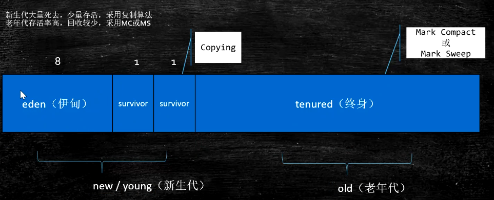

### 运行时数据区 Runtime Data Area

书籍：1. JSL 2.JVMS

**Direct Memory**

使用 NIO，直接访问操作系统内核空间的内存（OS管理的内存），省去拷贝到虚拟机的过程

**PC**

每个虚拟机线程都有一个**私有**的程序计数器，下一条指令在哪里

#### Stack

每个线程都有一个**私有**栈，里边存放**栈帧 frames**

1. Frame

   1. Local Variable Table，局部变量表

   2. Operand Stack 操作数栈

   3. Dynamic Linking 动态链接

      符号解析（比如函数调用时），去常量池查找

      https://blog.csdn.net/qq_41813060/article/details/88379473

      jvms 2.6.3

   4. Return Address 返回值地址

      a方法调用b方法，b执行结束后返回值放在哪里和b方法结束后应该回到那个地址上继续执行

   **实验**：查看指令，本地变量表 **i++ 和 ++i**

   > **补充：**
   >
   > 指令集：
   >
   > - 基于栈的指令集，为**JVM**所采用（其中 本地变量表 类似于寄存器，即用来存放临时变量，比较简单，速度慢
   > - 基于寄存器的指令集，汇编语言使用各种寄存器EX,DX,CX,,,,比较复杂，运行速度快

**⭐ 栈的执行过程，不同代码下的情况**

new对象，半初始化状态

递归调用

> Frames：
>
> **指令：**（查手册
>
> - \<clinit>  class-initialize，静态语句块
> - \<init>   构造方法
> - _store：弹栈
> - _load：压栈
> - invoke_xxx

#### 常用指令

- mul/div

- dup

- store

- load

- invoke

  - invokeStatic   调用静态方法

  - invokeVirtual   使用对象调用成员方法

  - invokeInterface    使用 接口调用方法

  - invokeSpecial     调用 构造方法等特殊的方法

    可以直接定位，不需要多态的方法

    比如 private方法，构造方法

  - invokeDynamic

    jvm最难的指令

    lambda表达式或者反射或者其他动态语言 scala kotlin，**动态产生的class**，会用到的指令

> 关于 **动态产生class**：
>
> Method Area  在 jdk<1.8 时是用 Permanent Space实现的，FGC不会清理，会产生OOM；jdk>=1.8时使用 Meta Space实现，FGC会触发清理，如果清理不掉，也会产生OOM
>
> OOM：https://blog.csdn.net/qq_42447950/article/details/81435080

#### Heap

为虚拟机线程共享

**Method Area**

为虚拟机线程共享，不同版本jdk的实现：

1. Perm Space (<1.8)

   字符串常量位于PermSpace

   FGC不会清理

   大小在启动时指定，不能变

2. Meta Space (>=1.8)

   字符串常量位于 堆

   会触发FGC清理

   启动时不设定大小默认最大是物理内存

> 如何证明 jdk<1.8时字符串常量存放在PermSpace，>=1.8字符串常量存放在堆？
>
> > 结合GC：不断使用字符串常量，观察堆、MetaSpace

**Run-Time Constant Pool**

**Native Method Stack**

为什么每个线程都有一个PC，共用一个不行吗？

为了记录当前线程执行到了那里，切换回来后可以继续运行

### GC及调优

**什么是垃圾？**

没有引用指向的单独的或者一堆对象

#### 垃圾查找算法

1. 引用计数

   记录对象被引用的次数，如果为 0说明那个是垃圾

   会出现 **循环引用** 的问题

2. 根可达算法 ⭐⭐

   

   什么是根？程序启动一开始创建的对象。（main方法启用一个线程，在main方法栈帧里开始的对象

#### GC算法 ⭐⭐

**标记清除 Mark Sweep** 

特点：算法简单，存活对象比较多的情况下效率较高，垃圾少

缺点：两遍扫描，效率较低，容易产生碎片

> - 适合 伊甸区 吗？
>
>   不适合，伊甸区存活对象比较少
>
> - 两遍扫描？
>
>   第一遍 【使用根可达法】标记不可回收的，第二遍清除可回收的

**拷贝算法 Copy**

特点：使用于存活对象较少的情况，扫描一次，效率提高，没有碎片，**适用于伊甸区**

缺点：空间浪费，移动复制对象，需要调正对象**引用**

**标记压缩 Mark-Compact**

特点：不会产生碎片，方便对象分配，不会产生内存减半

缺点：扫描两次，需要移动对象，效率偏低

#### JVM内存分代模型（用于分代垃圾回收算法

1. 部分垃圾回收器使用的模型

> 除Epsilon ZGC Shenandoah之外的GC都是使用 逻辑分代模型
>
> G1是逻辑分代，物理不分代
>
> 除此之外不仅逻辑分区，而且物理分区

#### 栈上分配

- 线程私有的 **小对象**
- 无逃逸，外部的引用不指向分配的对象
- 支持标量替换 （“对象的属性替换对象”
- 无需调整

默认栈上分配是打开的

**使用栈上分配更快速，不需要垃圾回收**

**线程本地分配TLAB Thread-Local-Allocation-Buffer**

- 占用 Eden区，默认每个线程 1%
- 多线程不用竞争就可以申请空间(Eden区上)，提高效率
- 分配小对象
- 无需调整

> 相关参数：
>
> - **-XX:-DoEscapeAnalysis** 不进行逃逸分析
> - **-XX:-EliminateAllocations** 去掉标量替换 
> - **-XX:-UseTLAB** 不使用TLAB

#### 对象何时进入老年代

通过 **-XX:MaxTenuringThreshold** 指定次数 YGC (对象头部信息分代年龄占4bit)

- parallel Scavenge 15
- CMS 6
- G1 15

**动态年龄**

- YGC时，Eden+S1 ==> S2时，如果进入的对象超过S2的50%
- 把年龄最大的放入老年代

文章：https://jianshu.com/p/989d3b06a49d

#### 分配担保：（不重要）
YGC期间 survivor区空间不够了 空间担保直接进入老年代
参考：https://cloud.tencent.com/developer/article/1082730

#### 对象分配过程图

#### 常见的垃圾回收器

https://www.jianshu.com/p/5af387e3afba

...

